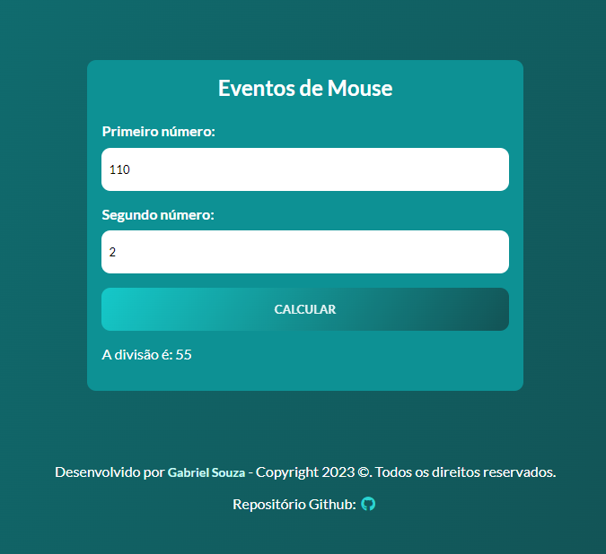

<p align="center">
  <a href="#projeto">Projeto</a>&nbsp;&nbsp;&nbsp;|&nbsp;&nbsp;&nbsp;
  <a href="#tecnologias-ferramentas">Tecnologias & Ferramentas</a>&nbsp;&nbsp;&nbsp;|&nbsp;&nbsp;&nbsp;
  <a href="#layout">Layout</a>&nbsp;&nbsp;&nbsp;|&nbsp;&nbsp;&nbsp;
  <a href="#elementosprincipais">Tópicos Abordados</a>
</p>

<h2>Sobre o projeto:</h2>

<p>Uma aplicação web onde é possível que o usuário digite dois números e consiga realizar operações de matemáticas básica (soma, subtração, multiplicação e divisão) com base nos eventos/movimentos do mouse sobre um botão. A lógica funciona da seguinte forma: 

<p>onMouseOver -----> Somar</p> 
<p>onDbClick -----> Subtrair</p> 
<p>onMouseOut-----> Dividir</p> 
<p>onClick -----> Multiplicar</p>

O objetivo do projeto foi trabalhar e por em prática como funciona a manipualção do DOM (Document Object Model), uso de funções, e principalmente EVENTOS do MOUSE com JavaScript.
</p>

<h2 id="projeto">Apresentação do projeto:</h2> 



<h2>Sobre o desenvolvimento do projeto:</h2>

<p>Durante o desenvolvimento pude por em prática e aprimorar minhas habilidades utilizando <strong>HTML5 e tags semânticas,</strong> <strong>CSS3 com sua estilização seguindo um padrão de cores</strong> e também pude compreender melhor como a manipulação de DOM, funções e eventos em<strong> JavaScript</strong>.</p> 

<h2>💻 Deploy:</h2>

- Visite o projeto online: [events-mouse](https://gabrieldev071.github.io/events-mouse/)

<h2 id="layout">🔖 Layout:</h2> 

Foi utilizado apenas uma paleta de cores para aplicar no porjeto. Você pode visualizar a paletra de cores do projeto através [DESSE LINK](https://uicolors.app/create). A cor que deu origem a paletra de cores é #16CFCF.

<h2 id="elementosprincipais">Elementos principais da página:</h2>

```
[1] Um sessão onde é possível que o usuário preenchar 2 campos de entrada de dados (primeiro número e segundo número) e possa clicar em um botão (calcular)
[2] Uma sessão de contato/direitos autorais (footer)
```
<h2 id="tecnologias-ferramentas">Tecnologias & Ferramentas:</h2>


<h3>Tópicos abordados durante projeto:</h3>

- JavaScript:

        - Utilização de Arrow function.
        - Captura elementos html da page com querySelector através DOM.
        - Manipulação do CSS através do JS/DOM.
        - Manipulação de classes com JS.
        - Utilização de funções
        - Utilização de condicionais switch.
        - Manipulação strings de acordo com input do usuário.

- HTML5:

        - Tags como section, div, span, footer, nav, ul button, img, a,  h1, p, input, label.
        - Adicionar mais de um nome de classe a um elemento html.
        - Adicionar link de fontes padrão a ser utilizada na aplicação na sessão head do index.html.
        - Adicionar link de estilos a ser utilizado na aplicação na sessão head index.html.
        - Adicionar API de icons (Font Awesome) a ser utilizada na aplicação na sessão head do index.html

- CSS3:

        - Variáveis no CSS.
        - Reaproveitamenteo do código.
        - Responsividade (medidas relativas e para telas diferentes)
        - Utilização do flexbox.
        - Uso de paleta de cores.
        - Utilização pseudo-elementos e pseudo-classes.
        

<h3> Badge de conclusão do projeto: </h3> 


<h3 id="contato">Minhas redes e contato: </h3> 

<a href="https://www.linkedin.com/in/gabriel-albuquerque-souza-desenvolvedor/" target="_blank" ></a>
<a href="mailto:contato_gabriel_albuquerque@hotmail.com" target="_blank" ></a>
<a href="https://www.instagram.com/gabriell.dat/" target="_blank" ></a>
<a href="https://github.com/gabrieldev071" target="_blank" ></a>


